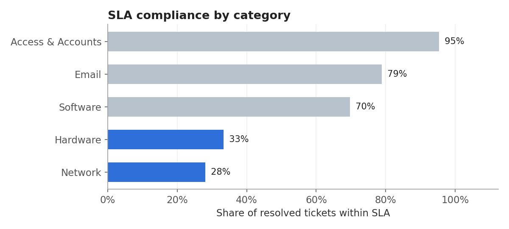
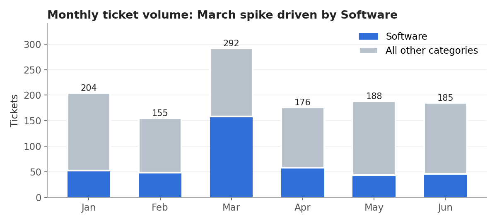
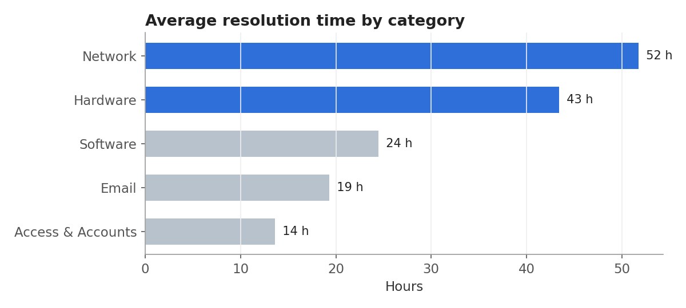

# Excel – IT Support Ticket Analysis

**Tools:** Microsoft Excel (COUNTIFS / AVERAGEIFS, INDEX-MATCH, conditional formatting, charts)  
**Data:** 1,200 help-desk tickets, Jan–Jun 2026 · [`it_support_tickets.csv`](it_support_tickets.csv)  
**Workbook:** [`IT_Ticket_Analysis.xlsx`](IT_Ticket_Analysis.xlsx)

> **Data note:** the dataset is synthetic. I generated it in Python to mimic a mid-sized company's help desk, so it contains no real company or personal data.

## 🎯 Business question
Where is IT support losing time, and are we meeting our SLAs?

## 📌 Headline KPIs
| KPI | Value |
|---|---|
| Tickets logged | 1,200 (27 still open) |
| Average / median resolution time | 28.6 h / 18.5 h |
| SLA compliance | **64.5%** |
| Average CSAT (1–5) | 3.86 |

## 🔍 Key findings

**1. Infrastructure tickets are the main bottleneck.** Network and Hardware tickets meet their SLA only **28% and 33%** of the time and take **52 h and 43 h** to resolve on average. Access & Accounts tickets meet it 95% of the time. The Tier 2 Infrastructure team handles 32% of tickets but accounts for **62% of all SLA breaches** (257 of 417).

**2. Critical tickets miss their SLA most often.** Only **60%** of Critical and **56%** of High-priority tickets are resolved within target (4 h and 8 h). Low-priority tickets meet theirs 74% of the time, so the most urgent issues get the weakest performance.

**3. March had a Software surge.** Volume jumped to **292 tickets**, 61% above the average of the other months. Software tickets tripled (158 vs. about 49 a month), which points to a single event such as an application rollout or update.

**4. Slow resolution drives down satisfaction.** CSAT falls from **4.38** for Access & Accounts to **3.10** for Network, the same order as resolution time.

**5. The intake channel doesn't matter.** Email, phone, chat and portal tickets all land between 63% and 65% SLA compliance. The problem is in resolution, not intake.

## ✅ Recommendations
1. **Add capacity or an on-call rotation to Tier 2 Infrastructure**, starting with Network. Raising its compliance to 70% would lift overall SLA compliance from 64.5% to about 77%.
2. **Fast-track Critical and High tickets** with auto-escalation when a ticket reaches 50% of its SLA target.
3. **Plan for software releases** with pre-release comms, a knowledge-base article and temporary Tier 1 scripts to absorb the next spike.
4. **Track CSAT alongside SLA** in a monthly review, since the two move together.

## 🗂️ Workbook structure
| Sheet | Contents |
|---|---|
| `README` | Purpose, sheet guide, data note |
| `Tickets` | Raw log plus calculated columns: Status, Month, Resolution_Hours, SLA_Target_Hours (INDEX-MATCH), SLA_Met |
| `SLA Policy` | Editable SLA targets per priority. Every KPI recalculates when you change them |
| `KPI Summary` | Headline KPIs and breakdowns by category, priority, team, channel and month (COUNTIFS / AVERAGEIFS), with color scales and 4 charts |

## 🧠 Skills demonstrated
KPI design · SLA analysis · conditional aggregation (COUNTIFS / AVERAGEIFS) · lookup formulas · data cleaning with calculated columns · data visualization · turning findings into business recommendations
