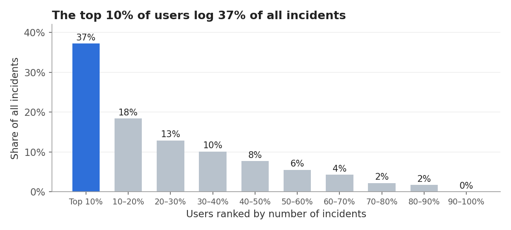
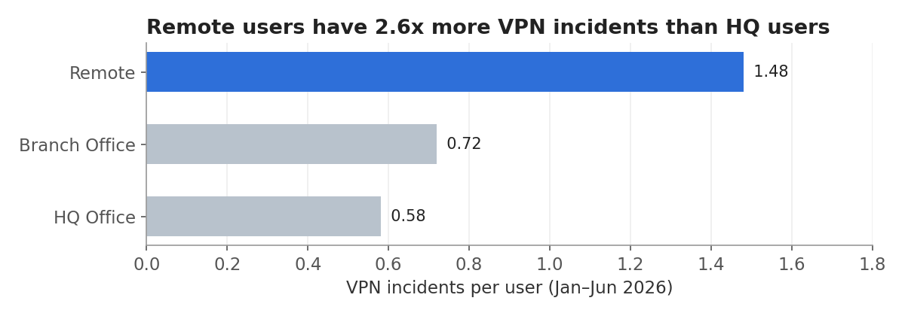
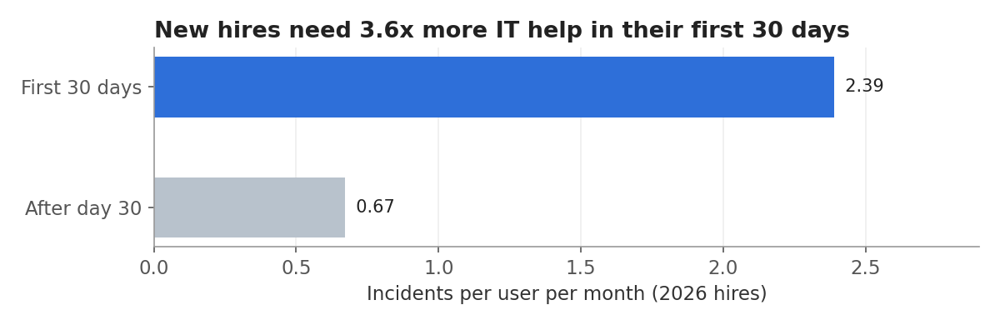

# SQL – IT Incident & User Analysis

**Tools:** SQL (SQLite): JOINs, CTEs, window functions (`LAG`, `RANK`, `NTILE`, `AVG OVER PARTITION`), `CASE`, subqueries  
**Data:** 2,031 incidents from 440 employees across 8 departments, Jan–Jun 2026, stored in a 5-table relational database  
**Files:** [`schema.sql`](schema.sql) · [`queries/`](queries) · [`data/`](data) · [`it_incidents.db`](it_incidents.db)

> **Data note:** the dataset is synthetic. I generated it in Python to mimic a mid-sized company's IT incident log, and the names are fictional. It contains no real company or personal data.

## 🎯 Business questions
1. Who creates the most IT incidents: which users, departments and locations?
2. Are there groups with specific needs, such as remote workers or new hires?
3. How do support teams and individual agents perform against SLA and quality targets?

## 🗃️ Data model
```
departments (1) ──< users (1) ──< incidents >── (1) agents
                                      │
                                      └──> sla_policy (severity → target hours)
```
| Table | Rows | Key columns |
|---|---|---|
| `departments` | 8 | department_id, department_name |
| `users` | 440 | user_id, department_id, location, device_os, hire_date |
| `agents` | 10 | agent_id, agent_name, team |
| `incidents` | 2,031 | incident_id, user_id, agent_id, opened_at, resolved_at, category, severity, reopened |
| `sla_policy` | 4 | severity, target_hours (P1 = 4 h, P2 = 8 h, P3 = 24 h, P4 = 72 h) |

## 📌 Headline KPIs ([Q2](queries/02_overview_kpis.sql))
| KPI | Value |
|---|---|
| Incidents | 2,031 (387 of 440 employees affected) |
| Avg resolution time | 24.1 h |
| SLA compliance | **75.9%** |
| Reopen rate | 6.8% |

Before analyzing anything, I ran data-quality checks ([Q1](queries/01_data_quality_checks.sql)) for orphaned keys, impossible timestamps, incidents logged before a user's hire date and duplicate IDs. All six checks passed.

## 🔍 Key findings

**1. A small group of users drives most of the demand.** The top 10% of users (44 people) logged **37%** of all incidents, and the top 30% logged **68.5%** ([Q5](queries/05_repeat_users_pareto.sql)). 7 of the 10 most frequent individual users keep hitting the same VPN or Software issues ([Q6](queries/06_top_repeat_users.sql)), which points to root causes that could be fixed once rather than ticket by ticket.



**2. Remote workers struggle with VPN.** Remote users log **1.48 VPN incidents each**, 2.6x the rate of HQ users (0.58). VPN makes up **29%** of remote users' incidents versus 13% at HQ ([Q7](queries/07_remote_vpn.sql)).



**3. Onboarding is an IT pain point.** Employees hired in 2026 averaged **2.39 incidents per month in their first 30 days** versus 0.67 afterwards, a **3.6x** difference. Over half (52%) of those early incidents are Login/MFA or Access Requests ([Q8](queries/08_new_hire_onboarding.sql)).



**4. Infrastructure is the SLA bottleneck.** Service Desk meets its SLA **91%** of the time and Infrastructure only **57%**. Infrastructure resolves 37% of incidents but accounts for **65% of all SLA breaches** (319 of 489). Its P2 incidents meet the 8-hour target only **38.5%** of the time ([Q10](queries/10_sla_by_team_severity.sql)).

| Team | P1 | P2 | P3 | P4 |
|---|---|---|---|---|
| Service Desk | 90.0% | 88.1% | 88.2% | 97.5% |
| Applications | 83.3% | 65.9% | 70.8% | 85.9% |
| Infrastructure | 76.9% | **38.5%** | **52.7%** | 73.4% |

**5. One agent's fixes don't stick.** On the Service Desk, one agent's tickets are reopened **15.2%** of the time, about double the team average of 7.7% ([Q9](queries/09_agent_performance.sql)). This calls for coaching or a closer look at the ticket mix, not blame.

**6. Department patterns.** Human Resources logs the most incidents per employee (**6.6**, versus a company average of 4.6), and Finance has the highest share of Software incidents (**26%**, versus 15–20% elsewhere), which suggests a problem with a department-specific application ([Q4](queries/04_department_incident_rate.sql)). Monthly volume is stable, between 310 and 353 incidents a month ([Q3](queries/03_monthly_trend.sql)).

## ✅ Recommendations
1. **Run a proactive "top repeat users" program.** Review the top 10% of users monthly and fix root causes (hardware swaps, VPN profiles, software reinstalls).
2. **Improve remote VPN reliability.** Audit VPN client versions for remote staff and publish a self-service troubleshooting guide.
3. **Build an IT onboarding checklist.** Pre-provision accounts, MFA and access before day one to cut first-month tickets.
4. **Add capacity or escalation rules for Infrastructure P2/P3 incidents,** for example auto-escalating at 50% of the SLA target.
5. **Coach and do QA reviews** for agents whose reopen rate is 50% or more above their team's average.

## 🧠 SQL techniques used
| Technique | Where |
|---|---|
| Multi-table `JOIN`s and `LEFT JOIN` for orphan checks | Q1, Q4, Q6, Q7, Q10 |
| Common table expressions (`WITH`) | Q2, Q3, Q4, Q5, Q7, Q8, Q9 |
| `LAG()` for month-over-month change | Q3 |
| `RANK()` and `NTILE()` | Q4, Q5 |
| Running totals with `SUM() OVER (ORDER BY …)` | Q5 |
| `AVG() OVER (PARTITION BY …)` for team benchmarks | Q9 |
| Correlated subquery | Q6 |
| Date arithmetic (`JULIANDAY`, `STRFTIME`) and exposure-adjusted rates | Q2, Q3, Q8 |
| Conditional aggregation (`SUM(condition)`, `CASE WHEN`) | Q4, Q7, Q8, Q9, Q10 |

## ▶️ How to run
```bash
# Option 1: use the ready-made database
sqlite3 it_incidents.db < queries/05_repeat_users_pareto.sql

# Option 2: rebuild from scratch
sqlite3 it_incidents.db < schema.sql
# then import the CSVs in data/ (e.g. with DB Browser for SQLite or .import --csv --skip 1)
```
The queries are written for SQLite. To run them in PostgreSQL or SQL Server, swap the date functions (`JULIANDAY`, `STRFTIME`) for their equivalents and write the boolean sums (`SUM(condition)`) as `SUM(CASE WHEN condition THEN 1 ELSE 0 END)`.
