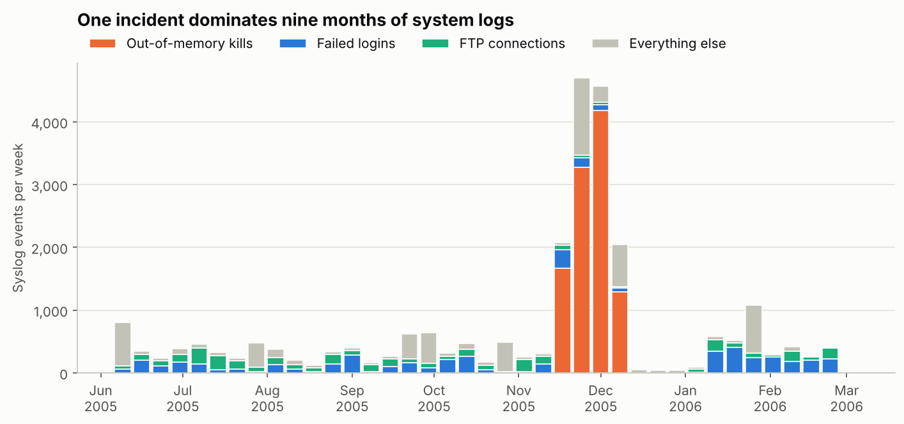
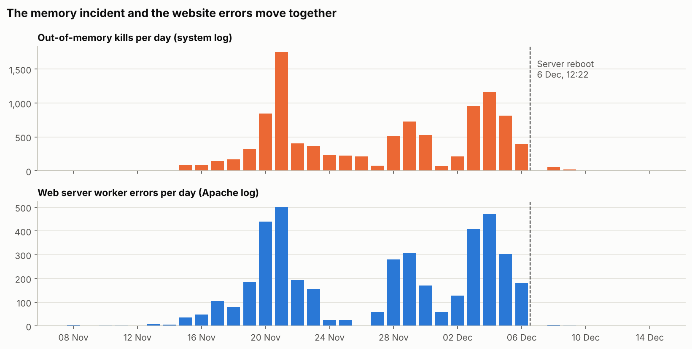
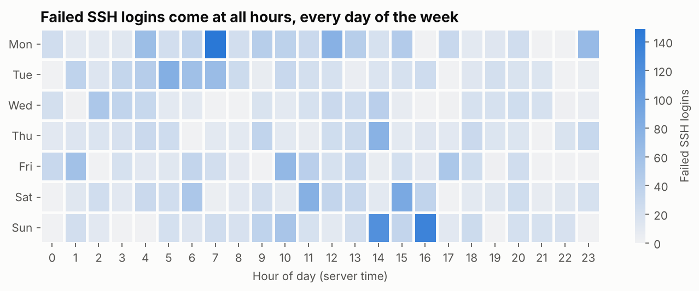
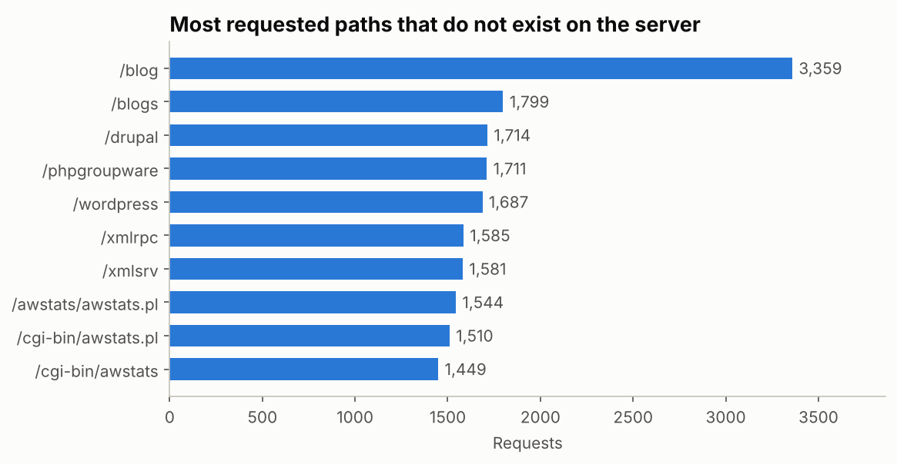

# Python – System Log & Performance Analysis

**Tools:** Python (Pandas, Matplotlib, Seaborn), regular expressions, Jupyter Notebook
**Data:** 77,553 parsed log events from one Linux server over 265 days (9 June 2005 to 28 February 2006): 25,549 system log events and 52,004 Apache web server events
**Files:** [`src/parse_logs.py`](src/parse_logs.py) · [`notebooks/system_log_analysis.ipynb`](notebooks/system_log_analysis.ipynb) · `data/` · `images/`

> **Data note:** unlike projects 1 and 2, this data is real. The two raw logs (`Linux.log` and `Apache.log`) come from [Loghub](https://github.com/logpai/loghub), a public collection of system logs that is freely available for research and academic work. Both logs were recorded on the same server (hostname `combo`).
> Citation: Jieming Zhu, Shilin He, Pinjia He, Jinyang Liu, Michael R. Lyu. *Loghub: A Large Collection of System Log Datasets for AI-driven Log Analytics.* ISSRE, 2023.

## 🎯 Business questions

1. Can the logs be trusted, and what is missing from them?
2. Was the server stable? If not, what went wrong and did users feel it?
3. Who was trying to get into the server, and did anyone succeed?
4. What are the web server errors really about?

## 🔧 Approach

| Step | What I did | Where |
|---|---|---|
| Parse | Turned raw text lines into tables with regular expressions (timestamp, component, message, client) | `src/parse_logs.py` |
| Clean | Rebuilt the missing year in the system log, set aside lines that could not be parsed, and reported how many | `src/parse_logs.py` |
| Classify | Labelled every line with an event type (memory kill, failed login, FTP connection, file not found, ...) | `src/parse_logs.py` |
| Analyse | Counted, grouped and resampled events by day, week and month, and joined the two logs by date | notebook |
| Visualise | Seven charts | notebook, `images/` |

## 📌 Headline numbers

| KPI | Value |
|---|---|
| Period covered | 265 days |
| Out-of-memory kills | 10,404 (40.7% of all system log events) |
| Length of the memory incident | 25 days (15 Nov to 9 Dec 2005) |
| Failed SSH logins | 3,934 from 345 hosts |
| Web errors caused by requests for files that do not exist | 63% (24,162 of 38,081) |

## 🔍 Key findings

**1. One memory incident produced 41% of all system log events.**
A typical month has about 1,600 system log events. November 2005 had 9,304. The extra volume is the Linux kernel killing processes because the server had run out of memory: 10,404 kills between 15 November and 9 December, and none outside that window.



**2. The incident built up for six days before it peaked, and nobody rebooted for three weeks.**
It started at 88 kills on the first day and peaked on 21 November at 1,750 kills, about 73 an hour. The first reboot came on 6 December. Kills fell from 2,913 in the three days before the reboot to 75 in the three days after, then stopped.

**3. The website went down with it.**
85.6% of the kills hit `httpd`, the web server. In the Apache log, 96% of all "worker in error state" errors in nine months fall inside the same 25 days: 167 a day during the incident and fewer than 1 a day outside it. The daily counts in the two logs move together (r = 0.97).



**4. The server was under constant automated password guessing.**
There were 3,934 failed SSH logins from 345 hosts, on 177 of 265 days. 57% targeted `root` and 26% used usernames that do not exist on the server. 72% arrived outside weekday office hours, and January 2006 was the worst month (877).



**5. The `test` account may have been compromised.**
`test` is the second most attacked real account (410 failed logins) and it also has 67 successful SSH sessions. 65 of them fall in two short bursts, and half were opened between midnight and 06:00. In the second burst (7 to 12 October 2005), 11 sessions opened within 10 minutes of a failed attempt on `test`, and those attempts came from five different outside hosts. This is what a guessed password looks like. The log cannot confirm it, because it does not record where successful logins came from.

**6. Most web errors are scanners, not broken pages.**
63% of Apache errors are requests for files or scripts that do not exist. The top paths are `/blog`, `/drupal`, `/wordpress`, `/phpgroupware`, `/xmlrpc` and `/awstats`. None of these applications is installed, so the requests are scanners looking for vulnerable software. January and February 2006 hold 66% of these requests.



**7. The logs have gaps of their own.**
7.9% of Apache lines (4,478) have no timestamp or client and had to be excluded. The system log records no year, so I took it from the Apache log, which starts on the same day and minute. Log rotation failed on 231 of the 265 days.

## ✅ Recommendations

1. **Alert on the first out-of-memory kill.** One log line would have flagged the incident six days before its peak.
2. **Monitor memory per process and cap the web server's workers.** The log shows which processes were killed, not which one used the memory.
3. **Harden SSH.** Disable direct `root` login and password authentication, and block addresses after repeated failures (for example with fail2ban).
4. **Lock the `test` account and investigate it,** starting with the sessions from 7 to 12 October 2005.
5. **Turn off FTP and telnet if they are not needed.** Both send passwords unencrypted. FTP received 3,357 connections, with up to 189 from one address in five minutes.
6. **Filter scanner traffic** so real web errors are not buried under probe noise.
7. **Fix the logging.** Add the year to system log timestamps and repair log rotation.

## ⚠️ Limitations

- This is one server, and the logs are from 2005 and 2006. The methods carry over to current systems, but the specific numbers do not.
- These are event logs. There are no CPU, memory or response-time measurements, so "performance" here means stability: memory kills, worker errors and reboots.
- The Apache file is an error log. It does not show successful requests, so error rates as a share of traffic cannot be calculated.
- Correlation between the two logs does not prove cause. The link between the memory kills and the web errors is supported by the fact that the killed process was the web server itself.

## 🧠 Python techniques used

| Technique | Where |
|---|---|
| Regular expressions with named groups to parse raw text | `parse_logs.py` |
| `str.extract` and `str.replace` to pull users, hosts and paths out of messages | `parse_logs.py` |
| Rebuilding a missing year from the month sequence | `parse_logs.py` |
| `resample` for daily, weekly and monthly time series | notebook, sections 1 to 5 |
| `groupby`, `value_counts`, `pivot_table`, `unstack` | notebook, sections 2 to 5 |
| Joining two sources by date and measuring correlation | notebook, section 3 |
| Time-window check with `apply` (failed attempts before each session) | notebook, section 4 |
| Stacked bars, small multiples and a heatmap with Matplotlib and Seaborn | notebook |

## ▶️ How to run

```bash
pip install -r requirements.txt

# 1. Parse the raw logs into clean CSV files (takes a few seconds)
python src/parse_logs.py

# 2. Open the notebook and run all cells
jupyter notebook notebooks/system_log_analysis.ipynb
```

The clean CSV files are already in `data/clean/`, so the notebook also runs without step 1.
