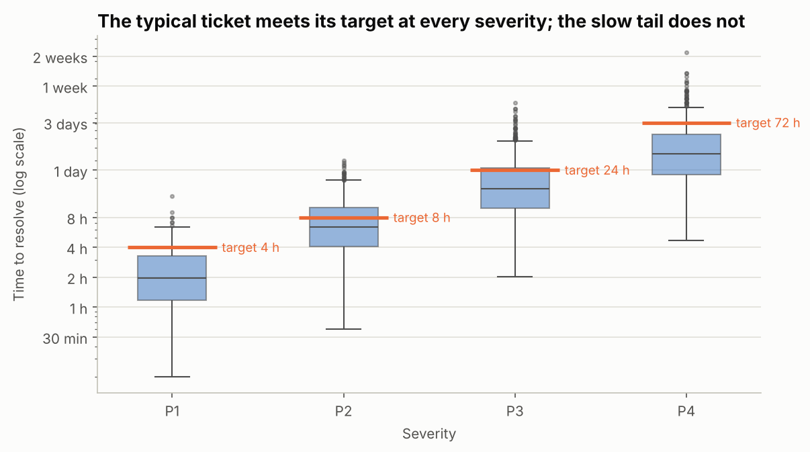
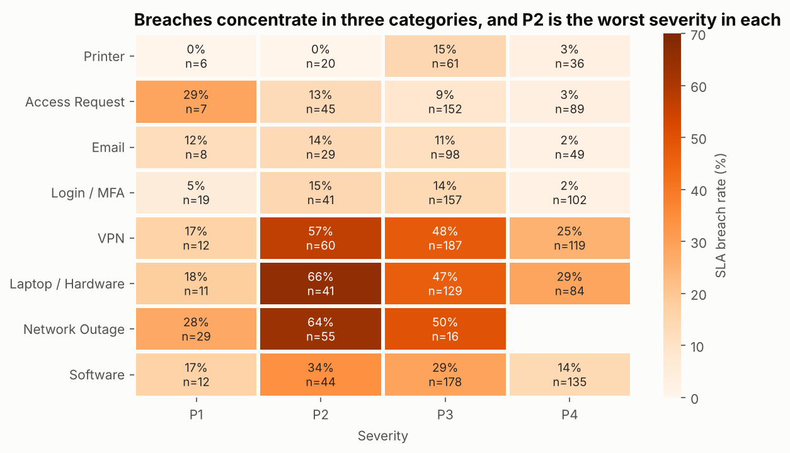
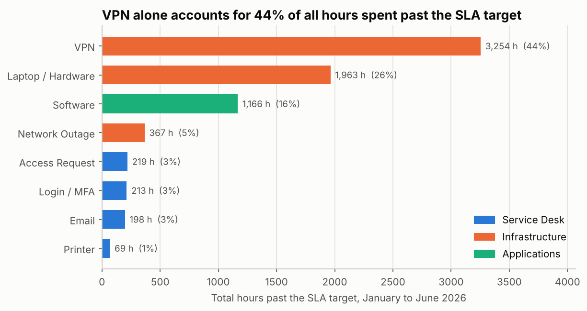
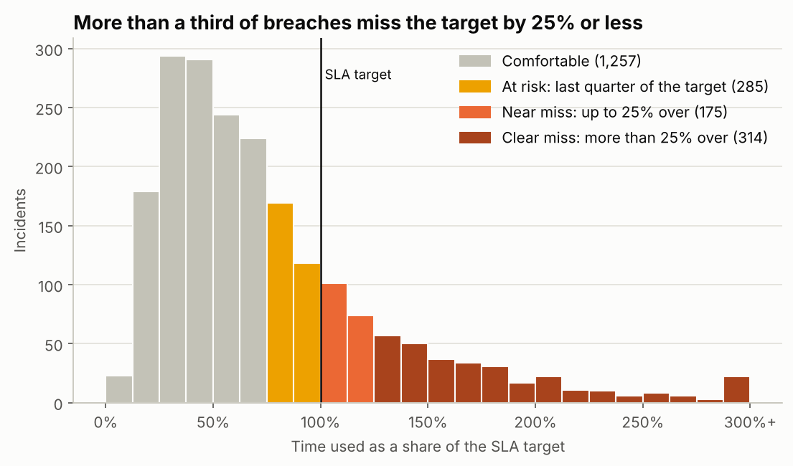
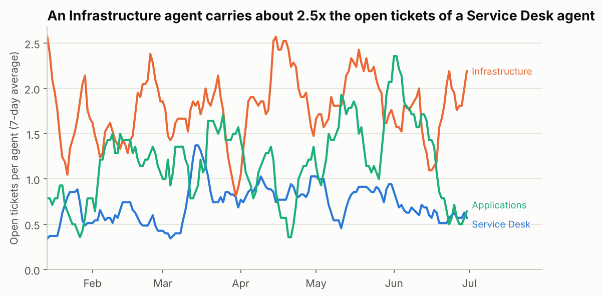
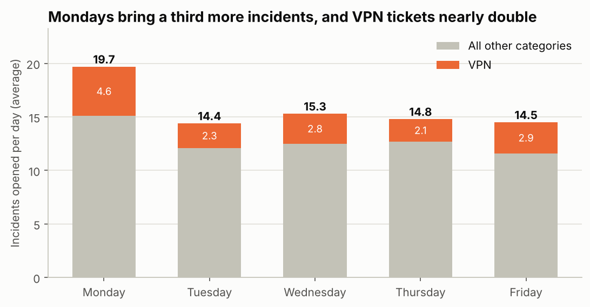
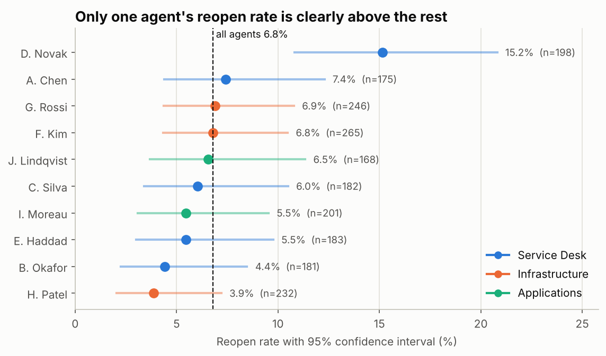

# Python – Incident Resolution & SLA Performance Analysis

**Tools:** Python (Pandas, NumPy, Matplotlib, Seaborn), SQLite, Jupyter Notebook  
**Data:** the same database as [project 2](../02-sql-incident-user-analysis): 2,031 incidents from 440 employees, Jan–Jun 2026, in a 5-table SQLite database  
**Files:** [`src/incident_kpis.py`](src/incident_kpis.py) · [`notebooks/incident_sla_analysis.ipynb`](notebooks/incident_sla_analysis.ipynb) · `images/`

> **Data note:** the dataset is synthetic. I generated it in Python to mimic a mid-sized company's IT incident log, and the names are fictional. It contains no real company or personal data. This project reads `it_incidents.db` directly from the project 2 folder, so there is one copy of the data.

[](https://colab.research.google.com/github/maria-antonia-analytics/data-analysis-portfolio/blob/main/04-python-incident-sla-analysis/notebooks/incident_sla_analysis.ipynb)

## 🎯 Business questions

Project 2 used SQL to find *which* teams and users have problems. This project uses Python for the questions SQL answers poorly:

1. How long do incidents really take, beyond the average?
2. Where does the SLA break, and is the comparison between teams fair?
3. How badly do breaches miss their target, and how many could be rescued?
4. Is the team that misses its SLA overloaded?
5. Which differences between agents and months are real, and which are noise?

## 🔧 Approach

| Step | What I did | Where |
|---|---|---|
| Load | One SQL query joins the five tables into a single Pandas table | `src/incident_kpis.py` |
| Check | Missing values, duplicate IDs, impossible timestamps, and what the SLA clock measures | notebook, section 1 |
| Enrich | Resolution hours, SLA met, time used as a share of target, hours past target | `src/incident_kpis.py` |
| Analyse | Percentiles, pivot tables, a running count of open tickets, a fair comparison across severity mixes | notebook, sections 2 to 5 |
| Test | Confidence intervals and permutation tests to separate real gaps from chance | notebook, sections 6 and 7 |
| Visualise | Seven charts | notebook, `images/` |

## 📌 Headline numbers

| KPI | Value |
|---|---|
| Resolution time | median 16.2 h, mean 24.1 h, 90th percentile 51.4 h |
| SLA compliance | 75.9% (489 breaches) |
| Hours spent past the SLA target | 7,449, of which VPN is 44% |
| Breaches that missed by 25% or less | 175 (35.8% of breaches) |
| Compliance if those near misses were caught | 84.5% |

## 🔍 Key findings

**1. The SLA problem is a tail problem.** The mean resolution time is 24.1 hours but the median is 16.2. At every severity the median ticket beats its target and the 90th percentile misses it.



**2. Breaches concentrate in three Infrastructure categories, worst at P2.** 66% of Laptop / Hardware P2 tickets breach, 64% of Network Outage P2 and 57% of VPN P2. Infrastructure does get more urgent tickets, but giving every team the same severity mix only moves its compliance from 57.1% to 57.9%. It is slower at every severity.



**3. Counting breaches understates the problem.** Infrastructure has 65% of the breaches but 75% of the hours spent past target. VPN alone accounts for 3,254 of 7,449 hours (44%).



**4. More than a third of breaches are near misses.** 175 breaches missed by 25% or less, and another 285 tickets only just made it. Catching every near miss would lift compliance from 75.9% to 84.5%. It would not fix Infrastructure (57.1% to 69.4%), where the typical breach runs 52% over target.



**5. Infrastructure carries more load, but load does not explain its breaches.** An Infrastructure agent has 1.81 tickets open on an average day, about 2.5 times a Service Desk agent (0.71). Yet Infrastructure tickets met the SLA 54.4% of the time when the queue was short and 54.2% when it was longest. The team is slow whether it is busy or quiet, which points to how the tickets are worked more than to headcount.



**6. Mondays bring a third more incidents.** 19.7 a day against 14.7 from Tuesday to Friday, and VPN tickets nearly double (4.6 a day against 2.5).



**7. One agent's reopen rate is a real difference. Three other gaps are noise.** D. Novak's tickets are reopened 15.2% of the time against 5.8% for the rest of the Service Desk. In 10,000 random shuffles, chance never produced a gap that large. The April dip in SLA compliance (71.8% against 76.8%, p = 0.05) is borderline, and the gaps for H. Patel (p = 0.11) and Mondays (p = 0.48) are within chance.



**8. A metric that looked useful and was not.** "Repeat contacts" (the same user opening the same category within 14 days) looked like a second quality signal: 204 incidents, 10% of the total. Shuffling categories among each user's own tickets produces 213 repeat contacts on average (95% range 193 to 232), so the real number is what heavy users produce by coincidence. I kept the `reopened` flag as the quality measure and did not report repeat contacts as a KPI.

## ✅ Recommendations

1. **Alert when a ticket reaches 75% of its SLA target.** 460 tickets (22.6%) were decided within a quarter of their target on either side.
2. **Review how Infrastructure P2 and P3 tickets are worked before adding headcount.** Breaches do not follow workload, so look at waiting steps first (parts, vendors, access, diagnosis). Start with VPN.
3. **Prepare for Mondays.** Check VPN health before Monday morning and schedule more Infrastructure cover that day.
4. **Report the median, the 90th percentile and hours past target** next to the average and the breach count.
5. **Review a sample of D. Novak's reopened tickets with the agent.** The gap is real and the cause is unknown. Resolution speed is similar to the rest of the team, so it does not look like rushing.
6. **Check significance before acting on a single month or a single agent.** Three of the four differences tested here were noise.

This refines one recommendation from project 2, which suggested adding capacity or escalation rules for Infrastructure. The escalation rule is supported by the near-miss analysis. The capacity argument is not supported by this data.

## ⚠️ Limitations

- The data is synthetic. The methods are the point, and the specific numbers describe a simulated company.
- The SLA clock measures elapsed calendar hours and never pauses. 16.4% of tickets are resolved on a weekend. Real service desks often measure business hours.
- There are no ticket status changes or wait reasons, so the analysis shows *that* Infrastructure tickets are slow but not *which step* is slow.
- A permutation test shows whether a gap is larger than chance. It does not explain the cause.

## 🧠 Python techniques used

| Technique | Where |
|---|---|
| `sqlite3` + `pd.read_sql` to load a multi-table join | `incident_kpis.py` |
| Reusable, documented functions imported into the notebook | `incident_kpis.py` |
| `describe` with custom percentiles, `pivot_table`, `crosstab`, `pd.cut` | notebook, sections 2 to 4 |
| Direct standardisation (same severity mix for every team) | `standardised_compliance` |
| Running totals with `cumsum` and `resample` to count open tickets over time | `open_backlog`, `open_when_opened` |
| `groupby` + `shift` to find repeat contacts | `repeat_contacts` |
| Wilson confidence intervals for rates | `wilson_interval` |
| Permutation tests with NumPy (seeded, reproducible) | `permutation_test`, `repeat_contacts_by_chance` |
| Box plot on a log scale, annotated heatmap, colour-banded histogram, interval plot | notebook |

## ▶️ How to run

```bash
pip install -r requirements.txt

# 1. Print the KPI summary from the command line
python src/incident_kpis.py

# 2. Open the notebook and run all cells
jupyter notebook notebooks/incident_sla_analysis.ipynb
```

No Python installed? Click the "Open in Colab" badge at the top and choose **Runtime > Run all**. The first cell downloads the project files.

The project needs the database from project 2 at `../02-sql-incident-user-analysis/it_incidents.db`, so keep both folders side by side.
